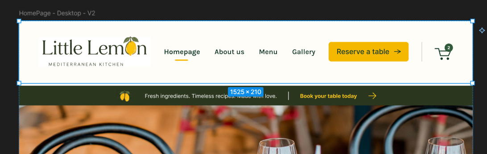

# Little Lemon Restaurant

A responsive restaurant ordering experience built with React, Material UI, React Router, React Hook Form, Zod, and an Express REST API.



## Highlights

- Responsive desktop and mobile restaurant interface
- Menu data loaded from an Express API
- Category filtering and a responsive recommendation carousel
- Direct, refresh-safe product detail routes
- Shopping cart with quantity controls and calculated totals
- Mock login and registration flow with protected API routes
- Checkout and authenticated order submission
- Reservation form validation with React Hook Form and Zod
- Loading, empty, success, and error states
- Route-level code splitting
- Automated API tests

## Tech stack

### Frontend

- React 19
- Vite
- Material UI and Emotion
- React Router
- React Hook Form
- Zod

### Backend

- Node.js
- Express
- CORS
- Node's built-in test runner
- In-memory mock data

## Project structure

```text
client/              React and Vite frontend
server/              Express API, static menu images, and API tests
docs/screenshots/    Interface previews
```

## Run locally

Node.js 18 or newer is recommended.

Install both applications from the repository root:

```bash
npm run install:all
```

Start the backend:

```bash
npm run dev:server
```

Start the frontend in a second terminal:

```bash
npm run dev:client
```

The frontend runs at `http://localhost:5173` and the API runs at `http://localhost:5000`.

## Environment variables

The project includes local fallback values, but deployment environments should use the provided example files.

### `client/.env`

```env
VITE_API_BASE_URL=http://localhost:5000
```

### `server/.env`

```env
PORT=5000
CLIENT_URL=http://localhost:5173
IMAGE_BASE_URL=http://localhost:5000/images
```

## Quality checks

Run linting, API tests, and the production frontend build together:

```bash
npm run check
```

Or run them separately:

```bash
npm run lint
npm run test
npm run build
```

The API test suite covers:

- API health response
- Menu collection and item lookup
- User registration and authenticated profile retrieval
- Rejection of unauthenticated orders
- Authenticated order creation and retrieval

## API endpoints

### Authentication

```text
POST /api/auth/register
POST /api/auth/login
GET  /api/auth/me
```

### Food items

```text
GET /api/food-items
GET /api/food-items/:id
```

### Orders

```text
POST /api/orders
GET  /api/orders/my-orders
```

Order routes require the bearer token returned by login or registration.

## Deployment

Deploy `client/` to a static frontend host and set `VITE_API_BASE_URL` to the deployed API URL.

Deploy `server/` to a Node.js host and set `CLIENT_URL` and `IMAGE_BASE_URL` to the public frontend and backend URLs.

## Mock-backend scope

The Express backend is intentionally designed as a portfolio demonstration. Users and orders are stored in memory and reset when the server restarts. Authentication tokens are mock tokens rather than production security credentials. A production version would add a database, password hashing, persistent sessions or signed tokens, and stricter request validation.
